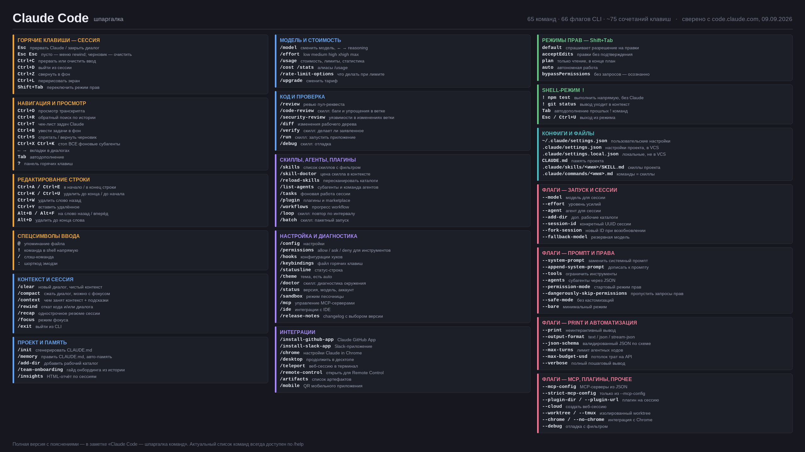

# ⌨️ Claude Code — шпаргалка

Плотная выжимка по разделам: клавиши, команды, режимы, конфиги, флаги. Всё сверено с официальной документацией на 09.09.2026. Полный разбор — в заметке [Claude Code — гайд](Claude%20Code%20%E2%80%94%20%D0%B3%D0%B0%D0%B9%D0%B4.md), обзор агентов — в [Сводной таблице](%D0%A1%D0%B2%D0%BE%D0%B4%D0%BD%D0%B0%D1%8F%20%D1%82%D0%B0%D0%B1%D0%BB%D0%B8%D1%86%D0%B0%20AI-%D0%B0%D0%B3%D0%B5%D0%BD%D1%82%D0%BE%D0%B2%20%D0%B4%D0%BB%D1%8F%20%D0%BF%D1%80%D0%BE%D0%B3%D1%80%D0%B0%D0%BC%D0%BC%D0%B8%D1%80%D0%BE%D0%B2%D0%B0%D0%BD%D0%B8%D1%8F%20%28%D0%B0%D0%B2%D0%B3%D1%83%D1%81%D1%82%202026%29.md).

## 🖼️ Постер для второго монитора



Собран из этой же заметки под **2560×1440 (2K/QHD)**, 387 КБ. Всё содержимое — из официальной документации, оформление своё. Файл: `Cache/Claude-Code/claude-code-cheatsheet-2560x1440.png`.

---

> [!tip] Как искать команду
> `/` в начале строки — список всех команд, дальше фильтруется по мере набора. Команда распознаётся **только в начале** сообщения, остальной текст уходит ей аргументом. `?` — панель горячих клавиш.

---

## 🔥 Горячие клавиши

**Управление сессией**

| Клавиши | Действие |
| :--- | :--- |
| `Esc` | Прервать Claude или закрыть диалог |
| `Esc` `Esc` | Пустая строка — меню rewind; есть черновик — очистить (вернуть `↑`) |
| `Ctrl+C` | Прервать или очистить ввод |
| `Ctrl+D` | Выйти из сессии |
| `Ctrl+Z` | Свернуть Claude Code в фон |
| `Ctrl+L` | Перерисовать/очистить экран |
| `Shift+Tab` | Переключить режим прав (цикл) |

**Навигация и просмотр**

| Клавиши | Действие |
| :--- | :--- |
| `Ctrl+O` | Просмотр транскрипта |
| `Ctrl+R` | Обратный поиск по истории |
| `Ctrl+T` | Чек-лист задач Claude |
| `Ctrl+B` | Увести выполняющиеся задачи в фон |
| `Ctrl+S` | Спрятать/вернуть черновик промпта |
| `Ctrl+X` `Ctrl+K` | Остановить **все** фоновые субагенты |
| `←` / `→` | Переключение вкладок в диалогах |
| `Tab` | Автодополнение; комментарий к ответу на запрос прав |

**Редактирование строки** (в стиле readline)

| Клавиши | Действие |
| :--- | :--- |
| `Ctrl+A` / `Ctrl+E` | В начало / в конец строки |
| `Ctrl+K` / `Ctrl+U` | Удалить до конца / до начала строки |
| `Ctrl+W` | Удалить слово назад |
| `Ctrl+Y` | Вставить удалённое |
| `Alt+B` / `Alt+F` | На слово назад / вперёд |
| `Alt+D` | Удалить до конца слова |

**Спецсимволы ввода**

| Символ | Что делает |
| :--- | :--- |
| `@` | Упоминание файла (подставит путь) |
| `!` | Выполнить команду в shell напрямую |
| `/` | Слэш-команда |
| `:` | Шорткод эмодзи |

---

## ⚡ Слэш-команды

**Контекст и сессия**

| Команда | Что делает |
| :--- | :--- |
| `/clear` | Новый диалог с чистым контекстом (память проекта остаётся) |
| `/compact` | Сжать диалог; можно задать фокус: `/compact оставь детали по API` |
| `/context` | Показать, чем занят контекст, и подсказки по оптимизации |
| `/rewind` | Откатить код и/или диалог к точке; алиасы `/checkpoint`, `/undo` |
| `/recap` | Однострочное резюме текущей сессии |
| `/focus` | Режим фокуса: только последний промпт и однострочные вызовы |
| `/exit` | Выйти из CLI |

**Проект и память**

| Команда | Что делает |
| :--- | :--- |
| `/init` | Сгенерировать стартовый `CLAUDE.md` |
| `/memory` | Править `CLAUDE.md`, включить/выключить авто-память |
| `/add-dir` | Добавить рабочий каталог в сессию |
| `/team-onboarding` | Гайд для онбординга команды из истории сессий |
| `/insights` | HTML-отчёт по недавним сессиям: зоны проекта, паттерны, трение |

**Модель и стоимость**

| Команда | Что делает |
| :--- | :--- |
| `/model` | Сменить модель (стрелки `←`/`→` — уровень reasoning) |
| `/effort` | Уровень усилий: `low`/`medium`/`high`/`xhigh`/`max` (`auto` по умолчанию) |
| `/usage` | Стоимость сессии, лимиты плана, статистика; алиасы `/cost`, `/stats` |
| `/rate-limit-options` | Что делать, когда упёрся в лимит |
| `/upgrade` | Открыть страницу смены тарифа |
| `/usage-credits` | Настроить или запросить кредиты |

**Код и проверка**

| Команда | Что делает |
| :--- | :--- |
| `/review` | Локальное ревью пул-реквеста |
| `/code-review` | **Скилл.** Ревью изменений ветки на баги и упрощения |
| `/security-review` | Анализ изменений ветки на уязвимости |
| `/diff` | Просмотр изменений в рабочем дереве |
| `/verify` | **Скилл.** Проверить, что изменение делает заявленное |
| `/run` | **Скилл.** Запустить приложение проекта и увидеть работу |
| `/debug` | **Скилл.** Отладка |

**Скиллы, агенты, плагины**

| Команда | Что делает |
| :--- | :--- |
| `/skills` | Список доступных скиллов с фильтром |
| `/skill-doctor` | Сколько каждый скилл стоит в контексте и как часто срабатывает |
| `/reload-skills` | Пересканировать каталоги скиллов и команд |
| `/list-agents` | Субагенты, участники команды агентов и прочие адресаты |
| `/tasks` | Фоновая работа сессии, включая субагентов |
| `/plugin` | Управление плагинами и marketplace |
| `/workflows` | Прогресс выполняющихся workflow |
| `/loop` | **Скилл.** Повторять промпт по интервалу |
| `/batch` | **Скилл.** Пакетный запуск |

**Настройка и диагностика**

| Команда | Что делает |
| :--- | :--- |
| `/config` | Настройки |
| `/permissions` | Правила allow/ask/deny для инструментов |
| `/hooks` | Конфигурации хуков |
| `/keybindings` | Открыть файл горячих клавиш |
| `/statusline` | Настроить статус-строку |
| `/theme` | Тема оформления, есть `auto` под тему терминала |
| `/doctor` | **Скилл.** Диагностика окружения и установки |
| `/status` | Версия, модель, аккаунт |
| `/sandbox` | Переключить режим песочницы |
| `/mcp` | Управление MCP-серверами |
| `/ide` | Интеграции с IDE |
| `/release-notes` | Changelog с выбором версии |

**Интеграции**

| Команда | Что делает |
| :--- | :--- |
| `/install-github-app` | Поставить Claude GitHub App на репозиторий |
| `/install-slack-app` | Поставить Slack-приложение |
| `/chrome` | Настройки Claude in Chrome |
| `/desktop` | Продолжить сессию в десктопном приложении |
| `/teleport` | Забрать веб-сессию в локальный терминал |
| `/remote-control` | Открыть сессию для Remote Control |
| `/artifacts` | Список опубликованных артефактов |
| `/mobile` | QR-код мобильного приложения; алиасы `/ios`, `/android` |

---

## 🔀 Режимы прав (`Shift+Tab`)

| Режим | Поведение |
| :--- | :--- |
| **default** | Действует, спрашивая разрешение на правки и команды |
| **acceptEdits** | Правки файлов применяются без подтверждения |
| **plan** | Только чтение и анализ, в конце предлагает план |
| **auto** | Автономная работа (если включён) |
| **bypassPermissions** | Без запросов прав — только осознанно |

Флаг `--permission-mode` задаёт режим при старте, `--allow-dangerously-skip-permissions` добавляет `bypassPermissions` в цикл `Shift+Tab`.

---

## 🐚 Shell-режим (`!`)

Префикс `!` выполняет команду **напрямую**, без участия Claude, и кладёт вывод в контекст:

```bash
! npm test
! git status
```

`Tab` — автодополнение из прошлых `!`-команд проекта. Выход: `Esc`, `Backspace` или `Ctrl+U` на пустой строке.

---

## 📁 Конфиги и файлы

| Путь | Назначение |
| :--- | :--- |
| `~/.claude/settings.json` | Пользовательские настройки |
| `.claude/settings.json` | Настройки проекта (в VCS) |
| `.claude/settings.local.json` | Локальные, не в VCS |
| `CLAUDE.md` | Память проекта |
| `.claude/skills/<имя>/SKILL.md` | Скиллы проекта |
| `.claude/commands/<имя>.md` | Кастомные команды (слиты со скиллами) |

> [!note] Команды и скиллы — теперь одно и то же
> Файл `.claude/commands/deploy.md` и скилл `.claude/skills/deploy/SKILL.md` оба дают `/deploy` и работают одинаково. Старые файлы `commands/` продолжают работать, но скиллы дают каталог для вспомогательных файлов, frontmatter для контроля вызова и автозагрузку по релевантности.

---

## 🚩 Флаги CLI

**Запуск и сессии**

| Флаг | Что делает |
| :--- | :--- |
| `--model` | Модель для сессии |
| `--effort` | Уровень усилий |
| `--agent` | Агент для сессии |
| `--add-dir` | Дополнительные рабочие каталоги |
| `--session-id` | Конкретный UUID сессии |
| `--fork-session` | При возобновлении создать новый ID |
| `--fallback-model` | Резервная модель при перегрузке основной |

**Промпты и инструменты**

| Флаг | Что делает |
| :--- | :--- |
| `--system-prompt` / `--system-prompt-file` | Заменить системный промпт целиком |
| `--append-system-prompt` | Дописать к системному промпту |
| `--tools` | Ограничить встроенные инструменты (`""` — отключить все) |
| `--agents` | Определить субагентов через JSON |
| `--disable-slash-commands` | Отключить скиллы и команды на сессию |

**Права и безопасность**

| Флаг | Что делает |
| :--- | :--- |
| `--permission-mode` | Стартовый режим прав |
| `--dangerously-skip-permissions` | Пропустить запросы прав |
| `--restricted` | Ограниченный режим |
| `--safe-mode` | Старт со всеми отключёнными кастомизациями |
| `--bare` | Минимальный режим без автообнаружения хуков и скиллов |

**Print-режим и автоматизация**

| Флаг | Что делает |
| :--- | :--- |
| `--print` | Неинтерактивный вывод |
| `--output-format` | `text` / `json` / `stream-json` |
| `--input-format` | `text` / `stream-json` |
| `--json-schema` | Валидированный JSON по схеме |
| `--max-turns` | Лимит агентных ходов |
| `--max-budget-usd` | Потолок трат на вызовы API |
| `--verbose` | Полный пошаговый вывод |

**MCP и плагины**

| Флаг | Что делает |
| :--- | :--- |
| `--mcp-config` | Загрузить MCP-серверы из JSON |
| `--strict-mcp-config` | Только серверы из `--mcp-config` |
| `--plugin-dir` / `--plugin-url` | Плагин из каталога или по URL на сессию |

**Прочее**

| Флаг | Что делает |
| :--- | :--- |
| `--cloud` | Создать веб-сессию |
| `--teleport` | Забрать веб-сессию локально |
| `--worktree` / `--tmux` | Изолированный worktree, опционально в tmux |
| `--chrome` / `--no-chrome` | Интеграция с Chrome |
| `--debug` | Отладка с фильтром категорий |

---

## 📌 Про исходный пост

Заметка обновлена по мотивам [поста «Не баг, а фича» от 21.08.2026](https://t.me/bugnotfeature/27215) с «ультимативной шпаргалкой на одном листе». Тот вариант — **картинка**, сделанная сторонним автором. Здесь та же идея собрана заново и **сверена с официальной документацией**: у Anthropic в справочнике **65 встроенных команд**, **66 флагов CLI** и около **75 сочетаний клавиш**.

> [!tip] Почему текстом, а не картинкой
> Растровую шпаргалку нельзя ни искать по `Ctrl+F`, ни обновить, когда Anthropic добавит команду, — а они добавляют часто. Текстовая версия ищется, правится и живёт в хранилище рядом с остальными заметками. Актуальный список всегда можно свериться командой `/help` прямо в CLI.

## 🔗 Ссылки

- Документация: [команды](https://code.claude.com/docs/en/commands) · [CLI reference](https://code.claude.com/docs/en/cli-reference) · [интерактивный режим](https://code.claude.com/docs/en/interactive-mode) · [настройки](https://code.claude.com/docs/en/settings)
- Связанные: [Claude Code — гайд](Claude%20Code%20%E2%80%94%20%D0%B3%D0%B0%D0%B9%D0%B4.md) · [Сводная таблица AI-агентов](%D0%A1%D0%B2%D0%BE%D0%B4%D0%BD%D0%B0%D1%8F%20%D1%82%D0%B0%D0%B1%D0%BB%D0%B8%D1%86%D0%B0%20AI-%D0%B0%D0%B3%D0%B5%D0%BD%D1%82%D0%BE%D0%B2%20%D0%B4%D0%BB%D1%8F%20%D0%BF%D1%80%D0%BE%D0%B3%D1%80%D0%B0%D0%BC%D0%BC%D0%B8%D1%80%D0%BE%D0%B2%D0%B0%D0%BD%D0%B8%D1%8F%20%28%D0%B0%D0%B2%D0%B3%D1%83%D1%81%D1%82%202026%29.md) · [MCP — серверы Model Context Protocol](Tooling/MCP%20%E2%80%94%20%D1%81%D0%B5%D1%80%D0%B2%D0%B5%D1%80%D1%8B%20Model%20Context%20Protocol.md) · [Claude Academy — официальные курсы](../../Education/Claude%20Academy%20%28Anthropic%29%20%E2%80%94%20%D0%B1%D0%B5%D1%81%D0%BF%D0%BB%D0%B0%D1%82%D0%BD%D0%B0%D1%8F%20%D0%B0%D0%BA%D0%B0%D0%B4%D0%B5%D0%BC%D0%B8%D1%8F%20%D0%BF%D0%BE%20Claude%20%2824%20%D0%BA%D1%83%D1%80%D1%81%D0%B0%20%D0%B8%20293%20%D0%BC%D0%B0%D1%82%D0%B5%D1%80%D0%B8%D0%B0%D0%BB%D0%B0%2C%20%D0%BD%D0%BE%20%D1%83%D1%80%D0%BE%D0%B2%D0%BD%D0%B5%D0%B9%20%D1%82%D1%80%D0%B8%2C%20%D0%B0%20%D0%BD%D0%B5%20%D1%88%D0%B5%D1%81%D1%82%D1%8C%3B%20%D1%81%D0%B5%D1%80%D1%82%D0%B8%D1%84%D0%B8%D0%BA%D0%B0%D1%82%D0%BE%D0%B2%20%D0%BF%D1%8F%D1%82%D1%8C%29.md)

#AI #Claude_Code #CLI #Шпаргалка
