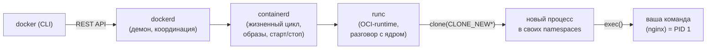
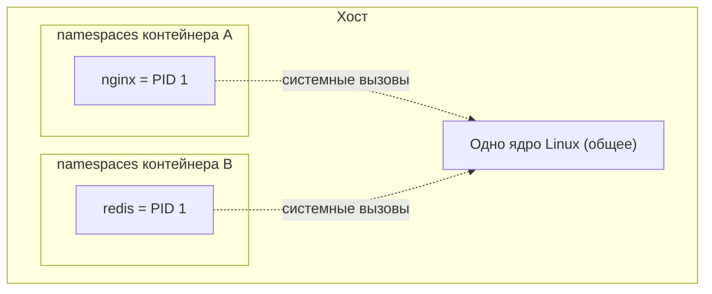
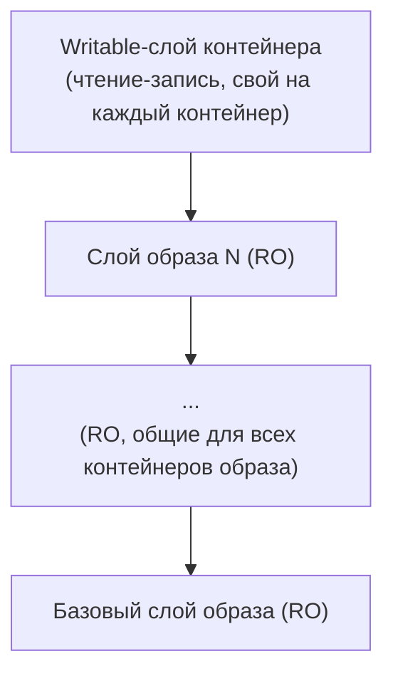
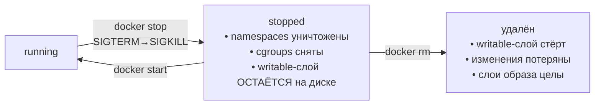

# 🐳 Внутри ядра Docker: что происходит при `docker run`

> [!note] Про заметку
> Конспект своими словами по мотивам статьи Muhammed Jamzeeth [«Inside the Docker Kernel»](https://medium.com/@mrjamzee002/inside-the-docker-kernel-what-really-happens-when-you-run-a-container-8e7f2e5c5786) (Medium) и её [перевода на Хабре](https://habr.com/ru/companies/timeweb/articles/981542/) (Timeweb Cloud). Схемы — свои (mermaid).

Контейнер — это **не виртуальная машина**, а обычный процесс Linux, обёрнутый в изоляцию средствами ядра. Никакой отдельной ОС внутри нет: процесс работает на **том же ядре хоста**, просто ему «показывают» урезанную картину мира. Две фичи ядра делают всю магию: **пространства имён (namespaces)** — что процесс *видит*, и **контрольные группы (cgroups)** — сколько ресурсов он *может съесть*. Плюс **OverlayFS** для файловой системы.

## Цепочка запуска: от команды до процесса

`docker run` не создаёт контейнер сам — он проходит через несколько слоёв, каждый из которых спускается ниже к ядру:

- **`dockerd`** — принимает команды по REST API, координирует, но тяжёлую работу не делает.
- **`containerd`** — высокоуровневый runtime: образы, запуск/остановка, жизненный цикл.
- **`runc`** — низкоуровневый runtime стандарта **OCI (Open Container Initiative)**, который напрямую дёргает ядро.

Ключевой момент — `runc` вызывает **`clone()`** (не обычный `fork()`) с флагами **`CLONE_NEW*`**: «создай процесс в новых пространствах имён». Затем через **`exec()`** на место процесса подставляется нужная команда (`nginx`), которая внутри контейнера становится **PID 1** — «init» своего мирка.

## Пространства имён: что контейнер видит

Каждый флаг `clone()` отрезает свой слой изоляции:

| Флаг | Пространство | Что изолирует |
| :--- | :--- | :--- |
| `CLONE_NEWPID` | PID | своя нумерация процессов; внутри — PID 1, на хосте это, скажем, PID 15234. `ps` покажет только «свои» |
| `CLONE_NEWNET` | Сеть | свои интерфейсы, таблицы маршрутизации, правила firewall → можно слушать :80 без конфликта с хостом |
| `CLONE_NEWNS` | Монтирование | своя раскладка каталогов; хостовый `/` не виден |
| `CLONE_NEWUTS` | UTS | своё hostname, независимое от хоста |
| `CLONE_NEWIPC` | IPC | свои семафоры и разделяемая память |
| `CLONE_NEWUSER` | User | своё сопоставление UID/GID → root в контейнере ≠ root на хосте |
| `CLONE_NEWCGROUP` | Cgroup | виден только свой сегмент иерархии cgroup |

Итог `clone()` — процесс, который **физически живёт на хосте**, но действует внутри изолированного «пузыря»:

## Cgroups: сколько ресурсов можно

Namespaces решают «что видно», а **cgroups** — «сколько дадут». Лимиты вроде `--memory=256m --cpus=0.5` превращаются в записи в `/sys/fs/cgroup/`, и ядро само их держит:

- **CPU-тротлинг** — превысил квоту → планировщик приостанавливает процесс до следующего окна.
- **Лимит памяти** — вышел за предел → срабатывает **OOM-killer** и убивает процесс(ы).
- **I/O-тротлинг** — контроллер I/O режет скорость чтения/записи на диск.

> [!tip] Проверить на практике
> Запусти CPU-нагрузку в контейнере с `--cpus=0.5 --memory=256m` и посмотри `docker stats`: контейнер упрётся в свою долю ЦП, хотя на хосте ресурсов ещё вагон.

## OverlayFS: слои и copy-on-write

Файловая система контейнера — это не монолит, а **стопка слоёв** (union mount):

- **Слои образа** — только чтение, лежат в `/var/lib/docker/overlay2/`, **общие** для всех контейнеров этого образа (экономия диска).
- **Writable-слой** — свой у каждого контейнера, поверх RO-слоёв.
- **Copy-on-write** — правишь файл (`/etc/nginx/nginx.conf`) → он копируется из RO-слоя в writable-слой, и изменения идут уже там; исходный образ не трогается.

## `stop` vs `rm`: где живут изменения

- **`docker stop`** — процесс получает `SIGTERM`, затем `SIGKILL`; namespaces исчезают (живут только с процессом), cgroup-лимиты снимаются, **но writable-слой остаётся** → после `docker start` данные на месте.
- **`docker rm`** — writable-слой удаляется, изменения теряются; слои образа не трогаются (их используют другие контейнеры).
- Для данных, которые должны пережить `rm`, — **тома (volumes)**: bind-каталоги с хоста в обход OverlayFS.

## Почему это так дёшево и в чём риск

100 контейнеров делят **одно ядро хоста** — нет накладных расходов гипервизора, старт почти мгновенный (`clone()` + `exec()`).

> [!warning] Обратная сторона общего ядра
> Уязвимость в ядре хоста бьёт по **всем** контейнерам сразу, а kernel-баг может дать **побег из контейнера** на хост. У ВМ ядра изолированы — модель угроз другая. Свежие примеры — в разделе «Связанные заметки» ниже.

## Итог

Контейнеры — не изобретение Docker, а удачная упаковка давних возможностей ядра: **namespaces** (2002–2013), **cgroups** (2006), **OverlayFS** (2014). При `docker run` ядро клонирует процесс с новыми namespaces, вешает на него cgroup-лимиты, монтирует многослойную ФС и делает `exec()`. «Контейнер» — это иллюзия, которую создаёт ядро вокруг обычного процесса.

## 🔗 Связанные заметки

- Сканер безопасности Docker-образов: [DockerScan (cr0hn)](../../Security/Vulns/Linux/DockerScan%20(cr0hn)%20%E2%80%94%20%D1%81%D0%BA%D0%B0%D0%BD%D0%B5%D1%80%20%D0%B1%D0%B5%D0%B7%D0%BE%D0%BF%D0%B0%D1%81%D0%BD%D0%BE%D1%81%D1%82%D0%B8%20Docker-%D0%BE%D0%B1%D1%80%D0%B0%D0%B7%D0%BE%D0%B2%20%D0%BD%D0%B0%20Go%20(CIS%2C%20%D1%81%D0%B5%D0%BA%D1%80%D0%B5%D1%82%D1%8B%2C%20CVE)%20%E2%80%94%20%D1%80%D0%B0%D0%B7%D0%B1%D0%BE%D1%80%20%D0%B8%20%D0%BD%D1%8E%D0%B0%D0%BD%D1%81%20%D0%BB%D0%B8%D1%86%D0%B5%D0%BD%D0%B7%D0%B8%D0%B8.md)
- Пример реального стека в контейнерах: [docker-mailserver](../../Network/Mail/docker-mailserver%20%E2%80%94%20production-ready%20%D0%BF%D0%BE%D1%87%D1%82%D0%BE%D0%B2%D1%8B%D0%B9%20%D1%81%D0%B5%D1%80%D0%B2%D0%B5%D1%80%20%D0%B2%20%D0%BA%D0%BE%D0%BD%D1%82%D0%B5%D0%B9%D0%BD%D0%B5%D1%80%D0%B5%20(Postfix-Dovecot-Rspamd-ClamAV)%2C%20%D1%87%D1%82%D0%BE%20%D0%B2%D0%BD%D1%83%D1%82%D1%80%D0%B8%20%D0%B8%20%D0%BF%D0%BE%D0%B4%D0%B2%D0%BE%D0%B4%D0%BD%D1%8B%D0%B5%20%D0%BA%D0%B0%D0%BC%D0%BD%D0%B8%20self-hosting.md)
- Побег из контейнера через баг ядра: [GhostLock (CVE-2026-43499)](../../Security/Vulns/Linux/CVE/CVE-2026-43499%20%E2%80%94%20GhostLock%20(rtmutex-futex%20PI%20stack%20UAF%2C%20LPE%20%D0%B4%D0%BE%20root%20%D0%B8%20%D0%BF%D0%BE%D0%B1%D0%B5%D0%B3%20%D0%B8%D0%B7%20%D0%BA%D0%BE%D0%BD%D1%82%D0%B5%D0%B9%D0%BD%D0%B5%D1%80%D0%B0).md) · [SCTPhantom (CVE-2026-64564)](../../Security/Vulns/Linux/CVE/CVE-2026-64564%20%E2%80%94%20SCTPhantom%20(SCTP%20ASCONF%20transport%20UAF%2C%20LPE%20%D0%B4%D0%BE%20root%20%D0%B8%20%D0%BF%D0%BE%D0%B1%D0%B5%D0%B3%20%D0%B8%D0%B7%20%D0%BA%D0%BE%D0%BD%D1%82%D0%B5%D0%B9%D0%BD%D0%B5%D1%80%D0%B0).md)

## 🔗 Ссылки

- Перевод (Timeweb Cloud): [Хабр — Внутри ядра Docker](https://habr.com/ru/companies/timeweb/articles/981542/)
- Оригинал: [Muhammed Jamzeeth — Inside the Docker Kernel](https://medium.com/@mrjamzee002/inside-the-docker-kernel-what-really-happens-when-you-run-a-container-8e7f2e5c5786)
- Документация: [OCI Runtime Spec](https://github.com/opencontainers/runtime-spec) · [man7: namespaces(7)](https://man7.org/linux/man-pages/man7/namespaces.7.html) · [man7: cgroups(7)](https://man7.org/linux/man-pages/man7/cgroups.7.html)

#Docker #Linux #Ядро #Контейнеры #OCI #OverlayFS #Namespaces #Cgroups #Программирование
