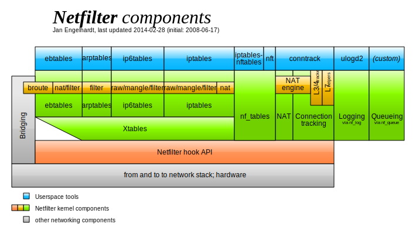
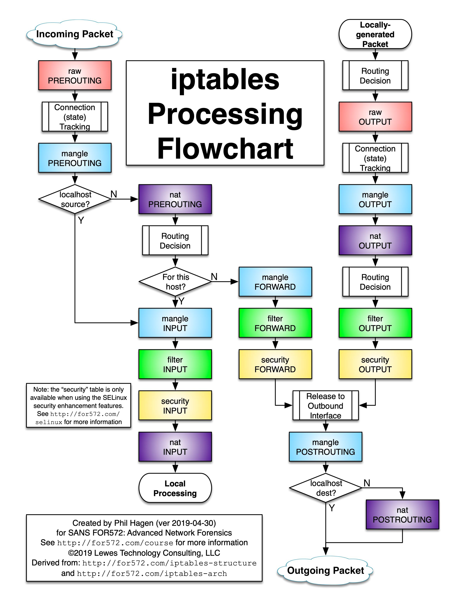
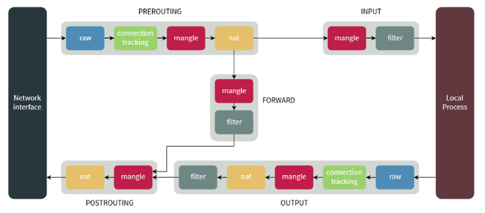
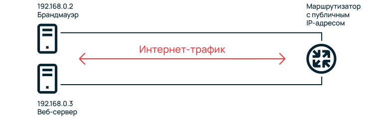
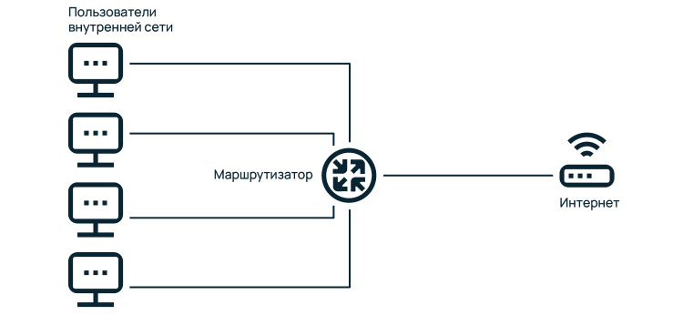

Эта заметка сделана по мотивам этого неплохого видео с ютуба:
[]
И вот этой статьи [Академия Selectel](https://selectel.ru/blog/setup-iptables-linux/).

**Iptables** на данный момент устаревающая система управления для **Netfilter hook API.** Вот компоненты системы **Netfilter**: 



### Управление фильтрацией

- iptables, ip6tables, arptables, ebtables - классический вариант
- nft - новая система (nf_tables)
- ufw (Ubuntu) - надстройка над iptables
- firewalld (CentOS) - надстройка над iptables или nf_tables для Red Hat систем ([RHEL](https://www.redhat.com/en/technologies/linux-platforms/enterprise-linux), [Fedora](https://fedoraproject.org/ru/), [CentOS](https://centos.org/), [Oracle Linux](https://www.oracle.com/cis/linux/), [Rocky Linux](https://rockylinux.org/ru/), [AlmaLinux](https://almalinux.org/))

Проблемы с надстройками в том что они разные в разных системах. 

### Движение пакетов в iptables


### Схема цепочек 


### Синтаксис iptables

Сетевой экран iptables очень гибок в настройке и имеет огромное количество разнообразных ключей и опций. Общий вид управляющей команды:
```
iptables таблица команда цепочка критерии действие
```

Рассмотрим каждый элемент в отдельности.

#### Цепочки

Существует 5 видов цепочек:

- **PREROUTING** — предназначена для первичной обработки входящих пакетов, адресованных как непосредственно серверу, так и другим узлам сети. Сюда попадает абсолютно весь входящий трафик для дальнейшего анализа.
- **INPUT** — для входящих пакетов, отправленных непосредственно этому серверу.
- **FORWARD** — для проходящих пакетов, не адресованных этому компьютеру, предназначены для передачи следующему узлу, в случае, если сервер выполняет роль маршрутизатора.
- **OUTPUT** — для пакетов, отправленных с этого сервера.
- **POSTROUTING** — здесь оказываются пакеты, предназначенные для передачи на другие узлы сети.

Также есть возможность создавать и удалять собственные цепочки, в большинстве случаев, в этом нет необходимости. Названия цепочек пишут заглавными буквами.

#### Таблицы

В netfilter существуют 5 типов таблиц:

-  **raw**  — Содержит цепочки **PREROUTING** и **OUTPUT**, здесь производятся манипуляции с пакетами до задействования механизма определения состояний.
- **mangle** — Предназначена для модификации заголовков сетевых пакетов, таких параметров как **ToS** (Type of Service), **TTL** (Time To Live), **MARK**. Содержит все существующие пять цепочек.
- **nat** — Используется для трансляции сетевых адресов, т.е. подмены адреса получателя/отправителя, применяется, если сервер используется в качестве маршрутизатора. Содержит цепочки **PREROUTING**, **OUTPUT**, **POSTROUTING**.
- **filter** — Основная таблица, служит для фильтрации пакетов, именно здесь происходит принятие решений о разрешении или запрете дальнейшего движения пакета в системе. Используется по умолчанию, если явно не указано имя другой таблицы. Содержит цепочки **INPUT**, **FORWARD** и **OUTPUT**.
- **security** — Используется для взаимодействия с внешними системами безопасности, в частности с SELinux и AppArmor. Содержит цепочки **INPUT**, **OUTPUT** и **FORWARD**.

Имена таблиц принято писать строчными буквами.

#### Команды

Для iptables команда — это инструкция к действию, при помощи них можно добавлять, удалять и сбрасывать все правила, задавать действия по умолчанию и многое другое. Команды могут подаваться как в сокращенном, так и в полном виде, более подробно в таблице:

|                |                     |                                                                                                                                           |
| -------------- | ------------------- | ----------------------------------------------------------------------------------------------------------------------------------------- |
| **Полный вид** | **Сокращенный вид** | **Описание**                                                                                                                              |
| —append        | -A                  | добавить правило в конец указанной цепочки                                                                                                |
| —check         | -C                  | проверить существующие правила в заданной цепочке                                                                                         |
| —delete        | -D                  | удалить правило с указанным номером в заданной цепочке                                                                                    |
| —insert        | -I                  | вставить правило с заданным номером, без указания номера — правило будет по умолчанию добавлено первым                                    |
| —replace       | -R                  | заменить правило с указанным номером                                                                                                      |
| —list          | -L                  | вывести список всех действующих правил со всех цепочек, если указать интересующую цепочку — вывод будет сделан только по ней              |
| —list-rules    | -S                  | построчный вывод всех правил во всех цепочках, если после ключа указать имя цепочки — будут выведены только ее правила                    |
| —flush         | -F                  | удалить все правила, при указании имени цепочки — правила удаляться только в ней                                                          |
| —zero          | -Z                  | обнулить все счетчики во всех цепочках, при указании цепочки — обнуление произойдет только в ней                                          |
| —new           | -N                  | создать пользовательскую цепочку                                                                                                          |
| —delete-chain  | -X                  | удалить пользовательскую цепочку                                                                                                          |
| —policy        | -P                  | установить политику по умолчанию для цепочки, обычно это ACCEPT или DROP, она будет применена к пакетам, не попавшим ни под один критерий |
| —rename-chain  | -E                  | переименовать цепочку, сначала указывается текущее имя, через пробел — новое                                                              |
| —help          | -h                  | вывести справочную информацию по синтаксису iptables                                                                                      |

#### Критерии

Чтобы к пакету применить какое-либо действие, он должен попасть под определенные критерии. Одно правило может содержать несколько критериев. Они, как и команды, имеют полную и сокращенную форму. Некоторые из них поддерживают логическую **НЕ**, если перед ними поставить знак **!** — критерий будет инвертирован. Список в таблице ниже:

|   |   |   |   |
|---|---|---|---|
|**Полный вид**|**Сокращенный вид**|**Поддержка инверсии**|**Описание**|
|—protocol|-p|да|указывает протокол, такие как tcp, udp, udplite и другие, поддерживаемые системой, ознакомиться со списком можно в файле /etc/protocols|
|—source|-s|да|указывает адрес источника пакета, в качестве значения можно указать как один IP-адрес, так и диапазон|
|—destination|-d|да|адрес получателя, синтаксис аналогичен предыдущему пункту|
|—match|-m|нет|подключает указанный модуль|
|—jump|-j|нет|когда правило подошло — выполнить указанное действие|
|—goto|-g|нет|перейти к указанной цепочке правил|
|—in-interface|-i|да|задает входящий сетевой интерфейс|
|—out-interface|-o|да|указывает исходящий сетевой интерфейс|
|—fragment|-f|да|указывает на фрагменты фрагментированных пакетов|
|—set-counters|-c|нет|устанавливает начальные значения счетчиков пакетов и байт|
|—destination-port|—dport|да|порт получателя пакета|
|—source-port|—sport|да|порт отправителя пакета|
#### Действия

Правилами задается поведение для iptables, каким образом поступить с тем или иным пакетом при попадании под заданные критерии. Решения, которые принимает брандмауэр, называют действиями, самые распространенные из них:

- **ACCEPT** — разрешить дальнейшее прохождение пакета по системе;
- **DROP** — выбросить пакет без уведомления отправителя;
- **REJECT** — отказать в прохождении пакета с уведомлением отправителя, такой способ может привести к дополнительным затратам ресурсов процессора, поэтому, в большинстве случаев рекомендуется использовать DROP;
- **LOG** — зафиксировать информацию о пакете в файле системного журнала;
- **MARK** — позволяет помечать определенные пакеты, например для маршрутизации, данная метка перестает существовать, как только пакет покинет брандмауэр;
- **CONNMARK** — то же самое, что и MARK, только для соединений;
- **QUEUE** — отправляет пакет в очередь приложению для дальнейшего взаимодействия;
- **RETURN** — прекращение движения пакета по текущей цепочке и возврат в предыдущую цепочку. Если текущая цепочка единственная — к пакету будет применено действие по умолчанию;
- **REDIRECT** — перенаправляет пакет на указанный порт, в пределах этого же узла, применяется для реализации «прозрачного» прокси;
- **DNAT** — подменяет адрес получателя в заголовке IP-пакета, основное применение — предоставление доступа к сервисам снаружи, находящимся внутри сети;
- **SNAT** — служит для преобразования сетевых адресов, применимо, когда за сервером находятся машины, которым необходимо предоставить доступ в Интернет, при этом от провайдера имеется статический IP-адрес;
- **MASQUERADE** — то же, что и SNAT, но главное отличие в том, что может использоваться, когда провайдер предоставляет динамический адрес, создаёт дополнительную нагрузку на систему по сравнению с SNAT;
- **TOS** — позволяет управлять битами в одноименном поле заголовка IP-пакета;
- **ULOG** — более продвинутый вариант записи информации, может писать как в обычный текстовый файл, так и в базу данных;
- **TTL** — используется для изменения значения поля одноименного заголовка IP-пакета, устанавливает время жизни пакета.
#### Состояние соединений

Система отслеживания состояния соединений conntrack — важная часть сетевого стека linux, встроенная в ядро. Используется для сопоставления пакетов с конкретными соединениями. Под анализ попадают все пакеты, кроме помеченных **NOTRACK**, в таблице **raw**. Все пакеты классифицируются на:

- **NEW** — открывается новое соединение, пришел только первый пакет;
- **ESTABLISHED** — соединение установлено, пришел уже не первый пакет в рамках этого сеанса. При правильной настройке iptables — такие пакеты проходят по системе без фильтрации, поскольку она уже была выполнена для первого пакета соединения;
- **RELATED** — открывается новое соединение, связанное с другим сеансом, имеющим статус ESTABLISHED;
- **INVALID** — помечаются пакеты, которые не связаны ни с одним из существующих соединений, и не могут создать новое, их невозможно идентифицировать. В целях безопасности рекомендуется остановить движение таких пакетов по системе, используя действие DROP.
-  **UNTRACKED** — пакет был помечен как не отслеживаемый  в таблице raw

## Основные команды iptables

### Команды iptables

- iptables  **-L** - просмотр списка правил
- iptables  **-F** - сброс правил (политика остаётся)
- iptables  **-P** - установка политики по умолчанию
- iptables  **-I** - вставить правило в начало списка
- iptables  **-A** - добавить правило в конец списка
- iptables  **-D** - удалить правило
- iptables  **-Z** - сбросить счетчики
### Как посмотреть список правил iptables

Отображать все действующие правила лучше с детализацией и нумерацией строк:
```bash
iptables --line-numbers -L -v -n
```
Ключ _—line-numbers_ нумерует строки, _-L_ выводит список правил всех цепочек, _-v_ отвечает за детализацию вывода, _-n_ выводит IP-адреса и номера портов в числовом формате.

### Как удалить правило в iptables

В первую очередь необходимо определить номер правила, которое требуется удалить, выводим список действующих правил командой:
```bash
iptables --line-numbers -L -v -n
```
Вывод:
```bash
Chain INPUT (policy ACCEPT 255 packets, 13366 bytes)
num   pkts bytes target     		prot 	opt in     out     source               destination
1            0        0 DROP       	all  	--    *      *       172.10.10.1         0.0.0.0/0
2            0        0 ACCEPT     	all  	--    *      *       192.168.111.1      0.0.0.0/0
3            0        0 ACCEPT     	tcp  	--    *      *        0.0.0.0/0	            0.0.0.0/0           tcp dpt:22
4            1      40 ACCEPT     	tcp  	--    *      *        0.0.0.0/0             0.0.0.0/0            tcp dpt:80
5            1      40 ACCEPT    	tcp  	--    *      *        0.0.0.0/0             0.0.0.0/0            tcp dpt:443

Chain FORWARD (policy ACCEPT 0 packets, 0 bytes)
num   pkts bytes target     prot opt in     out     source               destination

Chain OUTPUT (policy ACCEPT 256 packets, 15806 bytes)
num   pkts bytes target     prot opt in     out     source               destination
```

Предположим, требуется удалить правило 4 в цепочке **INPUT**:
```bash
iptables -D INPUT 4
```

Проверяем:
```bash
Chain INPUT (policy ACCEPT 77 packets, 8358 bytes)
num   pkts bytes target     		prot 	opt in     out     source               destination
1            0        0 DROP       	all  	--    *      *       172.10.10.1         0.0.0.0/0
2            0        0 ACCEPT     	all  	--    *      *       192.168.111.1      0.0.0.0/0
3            0      48 ACCEPT     	tcp  	--    *      *        0.0.0.0/0	            0.0.0.0/0           tcp dpt:22
5            1      40 ACCEPT    	tcp  	--    *      *        0.0.0.0/0             0.0.0.0/0            tcp dpt:443

Chain FORWARD (policy ACCEPT 0 packets, 0 bytes)
num   pkts bytes target     prot opt in     out     source               destination

Chain OUTPUT (policy ACCEPT 82 packets, 11150 bytes)
num   pkts bytes target     prot opt in     out     source               destination
```

Правило удалено.

### Как очистить список правил iptables

Сброс всех правил обычно требуется совместно с изменением политики по умолчанию на **ACCEPT**, эта процедура связана с вводом набора правил, поэтому удобнее всего создать небольшой скрипт для автоматизации процесса:
```bash
nano /etc/iptables.reset
```

Наполняем его командами:
```bash
#!/bin/bash
colGreen="\033[32m"
resetCol="\033[0m"
echo -n "Flushing firewall rules and changing default policy to ACCEPT..."
iptables -F
iptables -X
iptables -t nat -F
iptables -t nat -X
iptables -t mangle -F
iptables -t mangle -X
iptables -P INPUT ACCEPT
iptables -P FORWARD ACCEPT
iptables -P OUTPUT ACCEPT
echo -e "$colGreen Done! $resetCol"
```

Сохраняем и выходим. Команды можно последовательно подавать вручную, но это замедляет работу и увеличивает риск ошибки за счет влияния человеческого фактора.

Делаем файл исполняемым:
```bash
chmod +x /etc/iptables.reset
```

Даем команду:
```bash
/etc/iptables.reset
```

Правила сброшены, применяется политика по умолчанию **ACCEPT** для всех цепочек. 

### Как сохранить или восстановить правила iptables

Утилита iptables, как и маршрутизаторы Cisco, не сохраняет правила, если это явно не указать и после перезагрузки возвращается в предыдущее состояние. Установим пакет:
```bash
apt install iptables-persistent
```
В процессе установки на оба вопроса ответить Yes. Сохранить текущие правила:
```bash
service netfilter-persistent save
```
Система при следующей загрузке использует последние сохраненные правила.

### Как восстановить правила

В процессе настройки брандмауэра, по разным причинам, возникает необходимость вернуться к заведомо рабочим, испытанным правилам. Сервис _netfilter-persistent_ сохраняет их в файле _/etc/iptables/rules.v4_, если не успели сохранить активные правила, значит в файле предыдущая версия, восстанавливаем:
```bash
iptables-restore < /etc/iptables/rules.v4
```

### Как записать в лог событие

В процессе отладки правил, требуется фиксировать события в системном журнале. Запретим входящие пакеты на порт 80:
```bash
iptables -A INPUT -p tcp --dport 80 -j LOG --log-prefix "ACCESS RESTRICTED: "
iptables -A INPUT -p tcp --dport 80 -j DROP
```
Убедимся, что записи событий ведутся. Откроем файл журнала:
```bash
nano /var/log/syslog
```
В нем должны быть строки вида:
```bash
Apr 11 23:18:11 localhost kernel: [20400.047777] ACCESS RESTRICTED: IN=eth0 OUT= MAC=xx:yy:zz:xx:yy:zz:xx:yy:zz:xx:yy:zz:xx:yy SRC=111.222.121.212 DST=192.168.0.2 LEN=44 TOS=0x00 PREC=0x00 TTL=55 ID=49410 DF PROTO=TCP SPT=49170 DPT=80 WINDOW=65535 RES=0x00 SYN URGP=0
```
## Примеры настройки iptables

В данном разделе рассмотрим задачи, с которыми придется столкнуться, работая с iptables.

### Как заблокировать IP-адрес в iptables

Допустим, необходимо заблокировать компьютер с IP-адресом 172.10.10.1, тогда правило будет выглядеть следующим образом:
```bash
iptables -A INPUT -s 172.10.10.1 -j DROP
```
### Как разрешить IP-адрес в iptables

Необходимо разрешить весь трафик к серверу для клиента с IP-адресом 192.168.111.1:
```bash
iptables -A INPUT -s 192.168.111.1 -j ACCEPT
```
### Как открыть порт в iptables

Предположим, что политика по умолчанию — блокировать все, что явно не разрешено. Откроем порты веб-сервера для обеспечения работы HTTP протокола — порт 80, и поддержки HTTPS протокола совместно с SSL — порт 443. Также для доступа к серверу по SSH откроем порт 22. Эту задачу можно решить как минимум двумя способами: создать одно строчное правило, либо прописать правила по каждому из портов, рассмотрим оба. В одну строку:
```bash
iptables -A INPUT -p tcp -m multiport --dports 22,80,443 -j ACCEPT
```
При использовании расширения multiport, всегда необходимо использовать критерий _-p tcp_ или _-p udp_, таким образом, одной строкой можно указать до 15 разных портов через запятую. Важно не путать критерии —_-dport_ и —_-dports_. Первый из них используется для указания одного порта, второй сразу для нескольких, аналогично с _—sport_ и _—sports_.

Вариант много строчной записи — для каждого порта свое правило:
```bash
iptables -A INPUT -p tcp --dport 22 -j ACCEPT
iptables -A INPUT -p tcp --dport 80 -j ACCEPT
iptables -A INPUT -p tcp --dport 443 -j ACCEPT
```
### Как закрыть порт в iptables

Необходимость в закрытии порта может возникнуть, когда используется политика по умолчанию **ACCEPT** и доступ к определенному сервису нужно ограничить. Рассмотрим несколько ситуаций.

Закроем доступ к FTP серверу, работающему на 21 порту:
```bash
iptables -A INPUT -p tcp --dport 21 -j DROP
```
Оставим доступ только себе к SSH серверу, для остальных запретим:
```bash
iptables -A INPUT -p tcp ! -s 192.168.124.5 --dport 22 -j DROP
```
Здесь _192.168.124.5_ — IP-адрес доверенной машины, знак _!_ перед ключом _-s_ используется для инверсии, т.е. всем, кроме этого адреса доступ закрыт.
### Как разрешить или запретить ICMP ping трафик

Разрешить _ping_ хоста:
```bash
iptables -A INPUT -p icmp --icmp-type 8 -j ACCEPT
```
Запретить входящие icmp-пакеты:
```bash
iptables -A INPUT -p icmp --icmp-type 8 -j DROP
```
### Как разрешить трафик на локальном узле

Трафик на локальном сетевом интерфейсе lo должен быть разрешен для корректной работы сервисов, использующих для обмена данными интерфейс локальной петли, например, базы данных, прокси-сервера squid. Поэтому рекомендуется разрешить трафик на вход и выход:
```bash
iptables -A INPUT -i lo -j ACCEPT
iptables -A OUTPUT -o lo -j ACCEPT
```
### Как блокировать трафик по MAC-адресу

Устройство, которому хотим запретить доступ к серверу, имеет MAC-адрес _00:0A:EF:76:23:12_:
```bash
iptables -A INPUT -m mac --mac-source 00:0A:EF:76:23:12 -j DROP
```
Здесь ключ _-m_ вызывает расширение mac, ключ _—mac-source_ задает MAC-адрес узла, с которого поступил пакет.
### Как разрешить трафик по MAC-адресу

Необходимость может возникнуть в случае использования политики запрещения всего, что явно не разрешено, на практике редко встречается разрешение по MAC-адресам, команда iptables имеет вид:
```bash
iptables -A INPUT -m mac --mac-source 00:0A:EF:76:23:12 -j ACCEPT
```
### Как ограничить доступ по времени

В iptables существует модуль time, который позволяет регулировать доступ согласно расписанию. Например, запретим доступ к FTP серверу в среду с 08:10 до 08:15:
```bash
iptables -I INPUT -p tcp --dport 21 -m time --kerneltz --timestart 08:10 --timestop 08:15 --weekdays We --syn -j DROP
```

Рассмотрим подробнее значения ключей:

- **—kerneltz** — использование времени текущей временной зоны, иначе iptables будет работать по времени часового пояса UTC;
- **—timestart** — время начала срабатывания условия, допустимый диапазон указания времени с 00:00:00 до 23:59:59, можно указывать время в коротком варианте ЧЧ:ММ, как это сделано в примере;
- **—timestop** — время окончания действия условия, формат ввода аналогичен timestart;
- **—weekdays** — дни недели, в которые условие будет работать, допустимые значения Mon, Tue, Wed, Thu, Fri, Sat, Sun, или значения от 1 до 7. Так же поддерживается формат в два символа, например Mo, Tu, We и т.д. При необходимости указать несколько дней — перечисляются через запятую, без пробела, например Fr,Su,We,Tu;
- **—monthdays** — задает день месяца, допустимые значения от 1 до 31.

### Настройка NAT

Преобразование сетевых адресов (от англ. Network Address Translation) используется на маршрутизаторах, для взаимного предоставления сервисов между сетями согласно определенным правилам. В iptables для этого предусмотрена таблица nat, для которой характерны действия **DNAT**, **SNAT**, **MASQUERADE**, каждое из них описано в начале статьи. Рассмотрим практические задачи.

#### Проброс порта

**Дано**: локальная сеть состоящая из двух серверов и маршрутизатора с публичным IP-адресом.

Оба сервера имеют доступ в Интернет, но только один, используемый в качестве брандмауэра, — имеет публичный IP-адрес. Наглядная схема на иллюстрации ниже.



Это означает, что все пакеты, приходящие на публичный IP-адрес, доставляются сразу на компьютер с IP-адресом 192.168.0.2.

**Задача**: Предоставить доступ снаружи к веб-серверу с IP-адресом 192.168.0.3.

**Решение**: Все операции с iptables выполняются на сервере 192.168.0.2. В схеме получается два маршрутизатора. При запросе пользователем веб-страницы — пакет с маршрутизатора, который имеет публичный адрес, попадает на сервер-маршрутизатор 192.168.0.2, на порт 80, нужно его передать веб-серверу 192.168.0.3. Делаем первый шаг — меняем адрес назначения пакета:
```bash
iptables -t nat -A PREROUTING -p tcp -d 192.168.0.2 --dport 80 -j DNAT --to-destination 192.168.0.3:80
```
DNAT используется, если необходимо пользователям глобальной сети предоставить доступ к компьютеру, находящемуся за маршрутизатором, т.е. во внутренней сети, это называется пробросом портов.

Теперь нужно поменять адрес отправителя пакета на адрес маршрутизатора 192.168.0.2, который передаст пакет маршрутизатору с публичным IP-адресом, а он уже в свою очередь доставит пакет клиенту, используем для этого SNAT. Делаем второй шаг:
```bash
iptables -t nat -A POSTROUTING -p tcp -d 192.168.0.3 --dport 80 -j SNAT --to-source 192.168.0.2
```
Та же самая команда при использовании действия **MASQUERADE** не потребует ключа _—to-source_ и указания адреса, поскольку в таком случае происходит автоматическая подмена адреса отправления на IP-адрес сетевого интерфейса, с которого ушел пакет:
```bash
iptables -t nat -A POSTROUTING -p tcp -d 192.168.0.3 --dport 80 -j MASQUERADE
```
Проброс порта веб-сервера выполнен.

#### Переадресация порта — redirect

Перенаправление пакетов, пришедших на один порт, другому порту, называют переадресацией. В качестве примера — предварительно настроим веб-сервер на работу с портом 8080, добавим следующие правила:
```bash
iptables -A INPUT -p tcp --dport 8080 -j ACCEPT
iptables -t nat -A PREROUTING -p tcp --dport 80 -j REDIRECT --to-ports 8080
```
Действие **REDIRECT** выполняется в пределах одного сервера и имеет единственный ключ —_-to-ports_, указывающий порт назначения, этот ключ разрешается использовать, если критерий _-p_ явно задает используемый протокол _tcp_ или _udp_.

#### Использование в качестве маршрутизатора

Рассмотрим классическую схему для выхода в Интернет в рамках типового офиса. Имеется несколько компьютеров, которым надо предоставить доступ в глобальную сеть, один канал в Интернет, шлюз на основе компьютера c двумя сетевыми картами и операционной системой Linux.

Задача маршрутизатора не только предоставить доступ в Интернет, но еще и сделать это безопасно. Одна сетевая карта подключена в локальную сеть, по умолчанию будем считать доверенной зоной, другой сетевой адаптер с постоянным адресом подключен к сети Интернет. Схема подключения для наглядности:

Создадим файл:
```bash
touch /etc/iptables.router
```
Откроем, например, редактором nano:
```bash
nano /etc/iptables.router
```
Ниже представлен набор правил iptables с комментариями, для реализации данной схемы, копируем эти строки в открытый файл:
```bash
#!/bin/bash
# Объявление переменных
export FW="iptables"
# Интерфейс, подключенный к локальной сети
LAN="enp16s0"
# Интерфейс, подключенный к Интернету
WAN="enp0s25"
# Диапазон адресов локальной сети
LAN_NET="192.168.30.0/24"

# Очистка всех цепочек и удаление правил
$FW -F
$FW -F -t nat
$FW -F -t mangle
$FW -X
$FW -t nat -X
$FW -t mangle -X

# Разрешить входящий трафик к интерфейсу локальной петли,
# это необходимо для корректной работы некоторых сервисов
$FW -A INPUT -i lo -j ACCEPT

# Разрешить на внутреннем интерфейсе весь трафик из локальной сети
$FW -A INPUT -i $LAN -s $LAN_NET -j ACCEPT

# Позволяем два, наиболее безопасных типа пинга
$FW -A INPUT -p icmp --icmp-type 0 -j ACCEPT
$FW -A INPUT -p icmp --icmp-type 8 -j ACCEPT

# Разрешить входящие соединения, которые были разрешены в рамках других соединений
$FW -A INPUT -m conntrack --ctstate RELATED,ESTABLISHED -j ACCEPT

# Разрешить перенаправление трафика с внутренней сети наружу, как для новых,
# так и уже имеющихся соединений в системе
$FW -A FORWARD -i $LAN -o $WAN -m conntrack --ctstate NEW,RELATED,ESTABLISHED -j ACCEPT

# Разрешить перенаправление только тех пакетов с внешней сети внутрь,
# которые уже являются частью имеющихся соединений
$FW -A FORWARD -i $WAN -o $LAN -m conntrack --ctstate RELATED,ESTABLISHED -j ACCEPT

# Выполняем трансляцию сетевых адресов, принадлежащих локальной сети
$FW -t nat -A POSTROUTING -o $WAN -s $LAN_NET -j MASQUERADE

# Устанавливаем политики по умолчанию:
# Входящий трафик — сбрасывать; Проходящий трафик — сбрасывать; Исходящий — разрешать
$FW -P INPUT DROP
$FW -P FORWARD DROP
$FW -P OUTPUT ACCEPT
```

**Важное замечание**. Данный набор правил — это примитивный маршрутизатор, частный случай, представлен для наглядности и не претендует на руководство по безопасности. Поэтому, каждому, кто будет копировать, необходимо изменить его под свои нужды, как минимум переменные LAN, WAN и LAN_NET.

Сохраняем файл сочетанием нажатий клавиш Ctrl+O, нажимаем ENTER для подтверждения, затем Ctrl+X для выхода. Делаем файл исполняемым:
```bash
chmod +x /etc/iptables.router
```
Активируем правила, выполнив подготовленный файл скрипта:
```bash
/etc/iptables.router
```
Включаем маршрутизацию пакетов в системе:
```bash
sysctl -w net.ipv4.ip_forward=1
```
Чтобы после перезагрузки маршрутизация заработала автоматически — нужно добавить в файл _/etc/sysctl.conf_ строку или привести уже имеющуюся к виду:
```bash
net.ipv4.ip_forward = 1
```
Осталось сохранить правила iptables:
```bash
service netfilter-persistent save
```
Доступ в Интернет предоставлен.

Источник [Настройка iptables в Linux](https://selectel.ru/blog/setup-iptables-linux/), [Работа с IPTables. Фильтрация пакетов](https://www.youtube.com/watch?v=B-xbs9IDVUQ)

#Linux #Iptables #CheatSheet 
