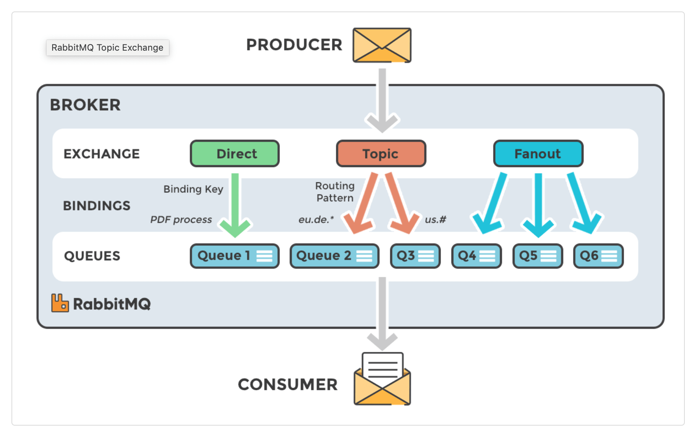
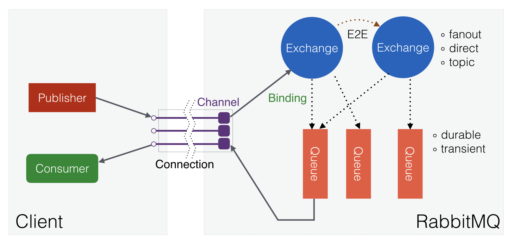

#### Ключевые особенности

1. **"Общий" мессенджер** - использует различные вариации паттернов общения: запрос-ответ, точка-точка и издатель подписчик.
2.  **Модель "умный мессенджер / глупый потребитель".**
3.  **Зрелая платформа** - хорошо поддерживается, доступна для Java, клиентских библиотек, .NET, Ruby, node.js. Предлагает десятки плагинов.
4.  **Коммуникация** - может быть синхронной(не приветствуется) или асинхронной.
5.  **Сценария развертывания** - предоставляет распределенные сценарии развертывания.
6.  **Кластеризация** - не зависит от внешних сервисов, однако специальные плагины форматирования кластеров могут использовать DNS, API, Consul  и т.д.
7.  **Push** подход	- методика передачи данных, при которой источник активно отправляет данные получателям без их предварительного запроса.

#### Основы RabbitMQ

[RabbitMQ](https://www.rabbitmq.com/) – это брокер сообщений с открытым исходным кодом, который реализует протокол AMQP (Advanced Message Queuing Protocol). Применяется в системах для асинхронной интеграции, где требуется гибкая и надежная маршрутизация сообщений.

Основная **фишка** RabbitMQ — это гибкая маршрутизация сообщений между различными поставщиками (продьюсерами) и потребителями (косьюмерами) событий. RabbitMQ – это не просто очередь данных между двумя сторонами, это менеджер очередей, который маршрутизирует данные в разные очереди сообщений. Продьюсер отправляет сообщения не в саму очередь, а на обменник, который сам распределяет сообщения между очередями.

Например, одно и то же сообщение должны получить три подписчика. Оно попадает на узел (обменник), который отправит три одинаковых сообщения в три очереди для всех подписчиков, которым оно должно быть доставлено. При этом в очереди может храниться любое количество сообщений от неограниченного количества поставщиков, а получать их может неограниченное число подписчиков.

**Подход к обмену сообщениями**

В RabbitMQ используется подход push, когда брокер сам активно отправляет сообщения консьюмерам, которые подписаны на очереди. Такой подход позволяет уменьшить задержку обработки данных и более равномерно распределить нагрузку между потребителями.

В RabbitMQ после получения консьюмерами сообщение удаляется из очереди. Благодаря этому одно и то же сообщение может быть обработано только одним консьюмером и не хранится дольше необходимого.

К минусам подхода push относится меньшая гибкость для потребителей. В отличие от модели pull, когда потребитель сам ходит за новыми сообщениями, когда ему надо, push не оставляет выбора потребителю – тот должен обработать поступившее сообщение. Кроме того, RabbitMQ не гарантирует порядок доставки сообщений.

**Процесс обмена сообщениями в RabbitMQ**

1. Создается именованный обменник, который является точкой интеграции между продюсером и консьюмером. Обменник задает правила маршрутизации сообщений.
2. Создаются одна или несколько очередей, которые привязываются к обменнику с помощью ключей маршрутизации.
3. Продюсер отправляет сообщение в обменник
4. Обменник, получив сообщение, маршрутизирует его в одну или несколько очередей в соответствии с правилами привязки между ним и очередью
5. Очередь отправляет сообщение потребителям (одному или нескольким), которые подписались на “push-уведомления” (поставили 🔔 на канале 😄)
6. Потребитель обрабатывает сообщение, исходя из своей бизнес-логики и отправляет брокеру подтверждение об успешной обработке (ack) или отказе (nack)
7. В случае успешной обработки брокер удаляет сообщение из очереди. В случае неудачной обработки со стороны потребителя (nack) сообщение остается в очереди, пока не будет успешно обработано

В случае некорректного завершения работы сервера, данные в очереди не теряются. И при последующем запуске обработка продолжается с того места, где был обрыв.
#### Архитектура RabbitMQ

RabbitMQ является распределенной системой. Все серверы объединяются в кластеры. Пересылка сообщений идёт через специальные узлы, называемые обменниками (_exchanges_), которые могут иметь разные типы и правила маршрутизации. Обменники отправляют сообщения в очереди (queues). Обменники и очереди связаны через _binding_ – правила, которое сообщает имеющемуся обмену в какой из очередей эти сообщения должны сохраняться. Очереди могут быть распределены между брокерами в кластере и реплицированы для надёжности.

#### Ключевые понятия: брокер, обмен, очередь, сообщение

##### 1. Брокер (Broker)
Брокер — это центральная часть системы RabbitMQ, которая принимает сообщения от производителей и маршрутизирует их к соответствующим очередям. Он также управляет подписками потребителей на очереди и гарантирует надежную доставку сообщений. Брокер RabbitMQ может быть развернут на одном или нескольких серверах, обеспечивая масштабируемость и отказоустойчивость.
##### 2. Обменник (Exchange)
Обменник — это компонент, который принимает сообщения от производителей и определяет, в какую очередь они должны быть направлены. RabbitMQ предоставляет различные типы обменов, такие как «direct», «topic», «headers» и «fanout», каждый из которых определяет правила маршрутизации сообщений. Например, обмен «direct» маршрутизирует сообщения на основе ключей маршрутизации, а обмен «fanout» отправляет сообщения во все подписанные очереди.
##### 3. Очередь (Queue)
Очередь — это хранилище сообщений в RabbitMQ. Она принимает сообщения из обменов и сохраняет их до тех пор, пока они не будут извлечены и обработаны потребителями. Очереди могут быть настроены с различными параметрами, такими как максимальный размер, время жизни сообщений и многое другое.
##### 4. Сообщение (Message)
Сообщение — это данные, которые производитель отправляет в RabbitMQ для последующей обработки. Сообщение обычно содержит полезную информацию, которую потребитель должен обработать. Кроме данных, сообщение также может содержать метаданные, такие как заголовки, которые могут быть использованы для дополнительной маршрутизации и обработки.

#### Очереди

Теперь рассмотрим каждый из объектов топологии RabbitMQ по отдельности с учётом их особенностей.  
  
Начнём разбор объектов с очередей (Queue). В RabbitMQ они работают по принципу [FIFO](https://ru.wikipedia.org/wiki/FIFO) (First Input First Output). При конфигурации очереди можно задавать как обязательные, так и необязательные параметры. Каждая очередь должна иметь уникальное имя и свойства, которые будут определять её поведение.  
  
Для демонстрации принципов работы RMQ возьмем сервис CloudAMQP — онлайн-платформу, которая предоставляет управляемые серверы RabbitMQ и LavinMQ в облаке. Она имеет подробную документацию и наглядный веб-интерфейс.

Интерфейс административной панели настройки очередей RabbitMQ

Создавать и настраивать очереди, а также указывать атрибуты для них необходимо через административную панель RabbitMQ в сервисе CloudAMQP. Сперва надо назвать очередь и определить её свойства, чтобы потребитель мог считывать данные из неё.  
  
При формировании имён необходимо учитывать ограничения RabbitMQ:  

1. Длина имени не должна превышать 255 символов в кодировке utf-8.
2. Имя не может начинаться со слова «amq.» — это зарезервированная часть для очередей создаваемых в RabbitMQ и используемых по умолчанию.

  
Помимо имени в административной панели RabbitMQ можно установить параметр свойства «Durable» (устойчивость) — это свойство определяет, сохранится ли очередь после перезапуска брокера. Для того, чтобы очередь была устойчива к сбоям брокера, этот параметр должен иметь значение «True» или, как указано в примере, «Durable».

**_Обратите внимание, что свойство «Устойчивость» не гарантирует, что сообщения в очереди, которые были опубликованы до сбоя, сохранятся после возобновления работы брокера. Это свойство гарантирует лишь сохранение самой очереди._**

Ещё одно важное свойство «Auto delete» (авто удаление). Оно означает, что как только последний потребитель заканчивает читать сообщения из очереди, она удаляется.  
  
Также здесь есть свойство «Arguments» — аргументы очереди, это свойство не является обязательным, но оно позволяет задавать время сообщения и очередей по отдельности, а также задавать ограничения длины очереди, как в сообщениях так и в байтах и другие свойства, которые мы подробно рассмотрим в разделе формулирования требований.

#### Точка обмена

Следующий объект брокера — точка обмена или обменник (Exchange). Все сообщения RabbitMQ, прежде чем попасть в очереди, публикуются в точке обмена брокера. Exchange принимает сообщения от приложения-производителя и направляет их в одну или несколько очередей на основе созданных связей между ним и очередью. В спецификации протокола AMQP, по которому работает RabbitMQ, существует несколько типов точек обмена, каждый со своей собственной семантикой маршрутизации.

|Тип точки обмена|Принцип работы|Сценарий применения|
|---|---|---|
|Direct|Прямая отправка сообщений в одну или несколько очередей с совпадающим значением ключа маршрутизации|Когда есть точно известный ключ, по значению которого отдельные приложения-потребители должны получить подходящие сообщения|
|Fanout|Все сообщения отправляются во все очереди независимо от ключа маршрутизации|Когда все приложения-потребители должны быстро получать все сообщения|
|Headers|Маршрутизация по нескольким атрибутам, заданным в заголовке сообщения. Ключ маршрутизации игнорируется|Когда правила маршрутизации сообщения в очереди сложнее, чем просто по ключу, например, формат данных, комбинация полей и пр.|
|Topic|Сообщение отправляется в конкретные очереди по значению ключа маршрутизации, заданного по шаблону|Когда ключ маршрутизации сложный и поток сообщений надо разделить по разным приложениям-потребителям|

Тип точки обмена настраивается при её создании в сервисе CloudAMQP.

Интерфейс административной панели настройки точки обмена RabbitMQ

При настройке типа задаются атрибуты точек обмена:  

1. **Name**, каждая точка обмена должна иметь уникальное название.
2. **Durable** — постоянная или «Transient» — временная очереди. Если есть необходимость создать постоянную точку обмена, которая будет храниться на диске даже после перезапуска сервера или брокера, то выбирается свойство «Durable». При выборе значения «Transient» точка обмена будет удаляться после перезагрузки.
3. **Internal** — внутренние точки обмена. Такой атрибут может принимать два значения: «да» или «нет». Если продюсеры не могут напрямую публиковать сообщения в эту точку обмена, то соответственно этот обменник имеет значение «нет». В том случае, если используем значение «да», то обменник используется исключительно в привязках с другими обменниками брокера.
4. **AutoDelete** — автоматическое удаление обменника. Этот атрибут удаляет точку обмена по завершению использования, после соответствующего удаления всех связанных с ней очередей.
5. **Arguments** — необязательные аргументы. Чаще всего через эти дополнительные аргументы задается альтернативная точка обмена. Она нужна в тех случаях, когда сообщение внутри брокера не может пройти по первоначальному маршруту, но с помощью данного аргумента его можно отправить в альтернативный обменник для маршрутизации по другому пути.

#### Сообщения

Третья сущность, которая участвует в информационном обмене — Сообщение (Message).  
  
В структуре Сообщения можно выделить три основных блока:  

- **Attributes** — заголовок;
- **Payload** — блок полезной нагрузки;
- **Headers** — заголовки сообщения, блок дополнительных атрибутов, участвующих в построении логики обработки и маршрутизации в топологиях брокера.

Структура сущности Сообщение

Атрибуты сообщения:  

1. **Routing key** — ключ маршрутизации, обязательная характеристика, которая позволяет обменнику типа Direct или Topic направить сообщение в очередь внутри брокера.
2. **Headers** — содержит дополнительную информацию для сложной маршрутизации и используется обменником типа Headers. Иногда может быть нужно выполнить маршрутизацию в зависимости от одного какого-то ключа. Чаще можно столкнуться с необходимостью выполнить проверку нескольких условий. Эти условия можно указать как атрибуты в поле заголовка (Headers) и затем использовать их в брокере для более сложной маршрутизации.
3. **Properties** — характеристики сообщений, наиболее важными из них являются тип (Content_type) и кодировка (Content_encoding).
4. **Delivery mode** — режим доставки, сохранение опубликованных сообщений до момента их передачи потребителю.

  
Выделяют две разновидности режима доставки:  

- Persistent — постоянная, то есть сохранение сообщений;
- Non-persistent — непостоянная, несохранение сообщений.
  
Этот атрибут работает в связке с атрибутом Durable. Если Durable обеспечивает сохранность очереди, то Delivery mode отвечает за то, чтобы в случае сбоя или перезагрузки сервера ранее опубликованные в ней сообщения были сохранены.

#### Маршрутизация сообщений

Теперь разберёмся, как задается маршрутизация в RabbitMQ. В интерфейсе менеджера, в разделе, посвященном точкам обмена, имеется поле Bindings. Оно необходимо для установления привязки, которая обеспечивает взаимосвязь очереди и точки обмена. При необходимости точки обмена могут быть также соединены не только с очередью, но и между собой.

Структура сообщения

В примере выше изображена структура отправляемого сообщения для последующей маршрутизации. Важно обратить внимание на специальное поле Routing key, содержащее ключ маршрутизации. Именно этот ключ должен совпадать с ключом, указанным в поле Bindings в настройках взаимодействия точек обмена и очереди.  
  
Также в примере «Структура сообщения» представлен способ отправки полезной json-нагрузки с помощью ещё одного ключа, который обеспечивает доставку полезной нагрузки от продюсера к брокеру и далее к консьюмеру.
#### Примеры привязок обменника с очередями

После того, как сообщение с определённым ключом маршрутизации попадает в точку обмена, его дальнейший маршрут внутри очереди определяется в зависимости от самого обменника. Рассмотрим примеры использования обменников типа Direct, Topic и Fanout.  
  
Начнем с **Direct exchange**, который обеспечивает передачу сообщений в очередь согласно строго заданному ключу маршрутизации.

Тип маршрутизации Direct exchange

Например, очередь привязана к обменнику с ключом маршрутизации «rk-a». Когда новое сообщение с таким ключом от приложения-продюсера с названием Producer 1 поступает в обменник с названием Е, тот направляет его в очередь Queue1 по совпадению ключа маршрутизации. Такой тип обменника полезен при адресной маршрутизации сообщений по конкретным потребителям.  
  
Далее рассмотрим тип точки обмена Topic exchange. Такой обменник также использует ключ для выборочной маршрутизации. Но, в отличие от прямого обменника, Topic использует шаблоны для сопоставления ключа, а не конкретное значение. Шаблон может включать следующие символы подстановки:    

- _*_ (звездочка) — заменяется ровно на одно слово;
- _#_ (решетка) — заменяется на 0 и более слов.

Тип маршрутизации Topic exchange

Например, к обменнику типа Topic привязаны разные очереди по следующим шаблонам:    

- user.delete.profile — ключ маршрутизации для привязки к очереди Queue1;
- user.*.profile — ключ маршрутизации для привязки к очереди Queue2;
- user.delete.* — ключ маршрутизации для привязки к очереди Queue3;
- user.# — ключ маршрутизации для привязки к очереди Queue4.
  
Тогда при публикации сообщения с ключом маршрутизации user.delete.profile оно попадет в очереди Queue1 и Queue4, а с ключом маршрутизации user.update.profile — в очереди Queue2 и Queue4. Если ключ маршрутизации будет равен user.delete.item, обменник направит сообщение в очереди Queue3 и Queue4. Данные из очередей получат потребители, которые на них подписаны.  
  
В заключение рассмотрим обменник типа **Fanout**, который просто реплицирует сообщения во все связанные с ним очереди или обменники без проверки ключа маршрутизации. Даже если сообщение было опубликовано с прямым или шаблонизированным ключом или атрибутами в заголовке — это игнорируется. Этот тип обменника самый быстрый, поскольку проверка и сопоставление атрибутов с заданным образцом не производится.

Тип маршрутизации Fanout exchange

#RabbitMQ 