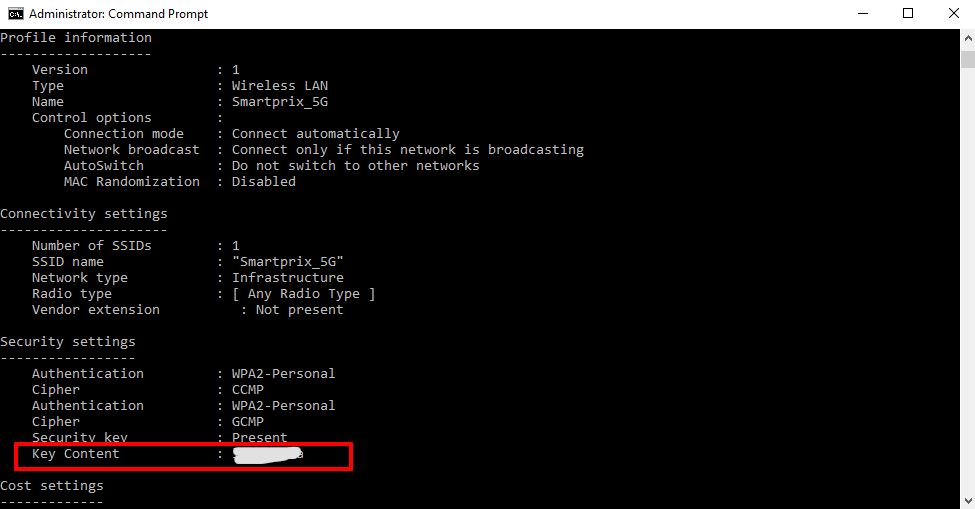

# Как посмотреть пароли от Wi-Fi, к которым вы подключались

Windows хранит профили **всех** Wi-Fi-сетей, к которым вы подключались, вместе с паролями. Достать их можно штатной командной строкой — без сторонних программ.

## 🔑 Быстрый способ (CMD / один пароль)

1. Открываем **CMD от имени администратора** (`key=clear` без прав администратора пароль не покажет).
2. Смотрим список сохранённых сетей:
   ```cmd
   netsh wlan show profiles
   ```
3. Смотрим пароль нужной сети (`Имя_сети` — из списка выше; если в названии пробелы — в кавычках):
   ```cmd
   netsh wlan show profile name="Имя_сети" key=clear
   ```

Пароль будет в разделе **«Параметры безопасности» → «Содержимое ключа»** (в англ. Windows — *Security settings → Key Content*).



## 📋 Все пароли сразу (PowerShell)

Чтобы не перебирать сети вручную, PowerShell выведет таблицу «сеть → пароль» одной командой (запускать в PowerShell **от администратора**):

```powershell
netsh wlan show profiles | Select-String ":\s(.+)$" | ForEach-Object {
    $ssid = $_.Matches.Groups[1].Value.Trim()
    $key  = (netsh wlan show profile name="$ssid" key=clear |
             Select-String "Содержимое ключа|Key Content" |
             ForEach-Object { ($_ -split ":")[-1].Trim() })
    [PSCustomObject]@{ SSID = $ssid; Password = $key }
} | Format-Table -AutoSize
```

> [!note] Локализация
> Поле называется **«Содержимое ключа»** в русской Windows и **«Key Content»** в английской — в команде учтены оба варианта. Если система на другом языке, подставьте свою строку.

## 💾 Экспортировать все профили с паролями

Выгрузит XML-файлы профилей (внутри — открытый пароль в теге `<keyMaterial>`), удобно для бэкапа/переноса:

```cmd
netsh wlan export profile key=clear folder=C:\wifi
```

Импорт обратно: `netsh wlan add profile filename="C:\wifi\Wi-Fi-Имя.xml"`.

## 🖱️ Через графический интерфейс

Работает **только для сети, к которой подключены сейчас**:
`Панель управления → Центр управления сетями → <имя адаптера> → Свойства беспроводной сети → вкладка «Безопасность» → «Отображать вводимые знаки»`.
Для всех прошлых сетей — только команды выше.

> [!caution] Безопасность
> `key=clear` показывает пароль **открытым текстом**. Это не «взлом» — вы видите только те сети, к которым **уже** подключался ваш ПК, и только с правами администратора. Но помните: любой, у кого есть админ-доступ (или физический доступ к разблокированной машине), так же легко вытащит все ваши Wi-Fi-пароли. На чужом/рабочем ПК своих сетей не сохраняйте без нужды.

## 🐧 То же самое на других системах

- **Linux (NetworkManager)** — пароли лежат в `/etc/NetworkManager/system-connections/*.nmconnection` (нужен root):
  ```bash
  sudo grep -H psk= /etc/NetworkManager/system-connections/*.nmconnection
  # или для конкретной сети:
  nmcli -s -g 802-11-wireless-security.psk connection show "Имя_сети"
  ```
- **Android** — с Android 10+ пароль можно показать/расшарить QR-кодом: *Настройки → Wi-Fi → нужная сеть → «Поделиться»* (без root).

#Windows #Wi-Fi #netsh #PowerShell #Password #Security
